# ДИАГРАММЫ АРХИТЕКТУРЫ EMERGENCY GRANT MANAGEMENT SYSTEM

## 1. HIGH-LEVEL GRANT CYCLE FLOW

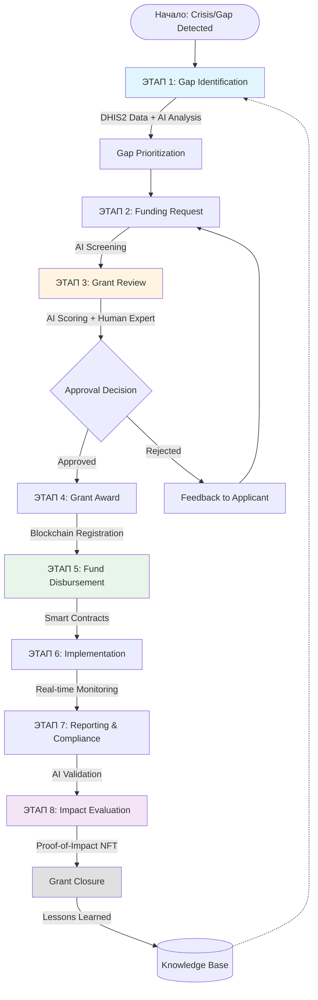

---

## 2. DETAILED GRANT CYCLE WITH AI & BLOCKCHAIN TOUCHPOINTS

```mermaid
graph TB
    subgraph "ЭТАП 1: GAP IDENTIFICATION"
        G1[DHIS2 Real-time Data] --> G2[AI Gap Detection]
        G2 --> G3[Statistical Analysis]
        G3 --> G4[Risk Assessment ML]
        G4 --> G5[Prioritized Gap List]
    end
    
    subgraph "ЭТАП 2: FUNDING REQUEST"
        F1[Application Submission] --> F2[AI Eligibility Check]
        F2 --> F3{Eligible?}
        F3 -->|Yes| F4[NLP Document Analysis]
        F3 -->|No| F5[Auto-Rejection + Feedback]
        F4 --> F6[Smart Reviewer Assignment]
    end
    
    subgraph "ЭТАП 3: REVIEW & EVALUATION"
        R1[Technical Review] --> R2[AI Scoring Assistant]
        R2 --> R3[Financial ML Analysis]
        R3 --> R4[Risk Prediction Model]
        R4 --> R5[Human Expert Review]
        R5 --> R6[Consensus & Ranking]
    end
    
    subgraph "ЭТАП 4: APPROVAL & AWARD"
        A1[Grant Committee] --> A2[Decision]
        A2 --> A3[Smart Contract Creation]
        A3 --> A4[Blockchain Registration]
        A4 --> A5[Grant Agreement NFT]
    end
    
    subgraph "ЭТАП 5: DISBURSEMENT"
        D1[Milestone Definition] --> D2[Smart Contract Logic]
        D2 --> D3[AML/Fraud AI Check]
        D3 --> D4{Clear?}
        D4 -->|Yes| D5[Blockchain Transaction]
        D4 -->|No| D6[Investigation]
        D5 --> D7[Funds Released]
    end
    
    subgraph "ЭТАП 6: IMPLEMENTATION MONITORING"
        I1[Activity Data Collection] --> I2[AI Anomaly Detection]
        I2 --> I3[Real-time Risk Alerts]
        I3 --> I4[DHIS2 Data Validation]
        I4 --> I5[Blockchain Evidence Logging]
    end
    
    subgraph "ЭТАП 7: REPORTING"
        RP1[Report Submission] --> RP2[AI Completeness Check]
        RP2 --> RP3[NLP Quality Assessment]
        RP3 --> RP4[Compliance Validation]
        RP4 --> RP5[Blockchain Record]
    end
    
    subgraph "ЭТАП 8: IMPACT EVALUATION"
        E1[Impact Measurement] --> E2[AI Multi-source Validation]
        E2 --> E3[Computer Vision Verification]
        E3 --> E4[Statistical Validation]
        E4 --> E5[Proof-of-Impact NFT Mint]
        E5 --> E6[Blockchain Certificate]
    end
    
    G5 --> F1
    F6 --> R1
    R6 --> A1
    A5 --> D1
    D7 --> I1
    I5 --> RP1
    RP5 --> E1
    E6 --> End([Grant Closure])
    
    style G2 fill:#ffeb3b
    style F2 fill:#ffeb3b
    style F4 fill:#ffeb3b
    style R2 fill:#ffeb3b
    style R3 fill:#ffeb3b
    style D3 fill:#ffeb3b
    style I2 fill:#ffeb3b
    style RP2 fill:#ffeb3b
    style E2 fill:#ffeb3b
    
    style A3 fill:#4caf50
    style A4 fill:#4caf50
    style D2 fill:#4caf50
    style D5 fill:#4caf50
    style I5 fill:#4caf50
    style RP5 fill:#4caf50
    style E6 fill:#4caf50
```

**Легенда:**
- 🟡 Желтый = AI/ML Processing
- 🟢 Зеленый = Blockchain Operations

---

## 3. SYSTEM ARCHITECTURE - LAYERED VIEW

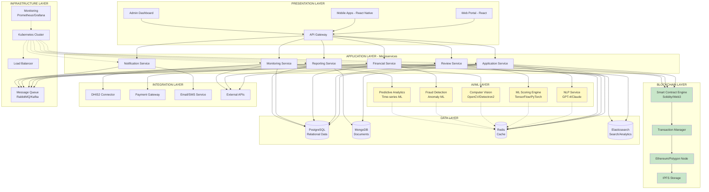

---

## 4. DATA FLOW ARCHITECTURE

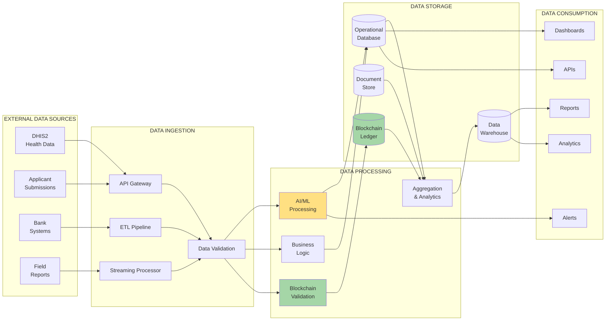

---

## 5. BLOCKCHAIN INTEGRATION DETAILED FLOW

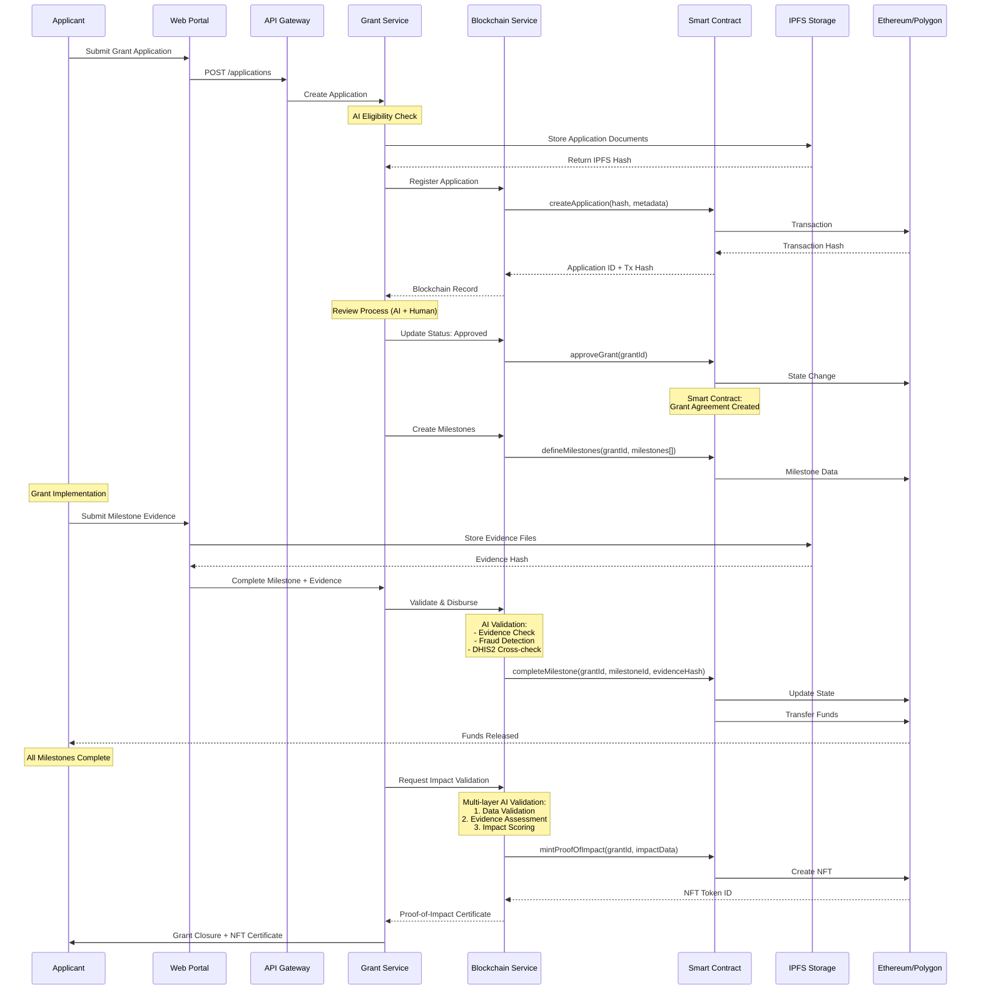

---

## 6. PROOF-OF-IMPACT VALIDATION FLOW

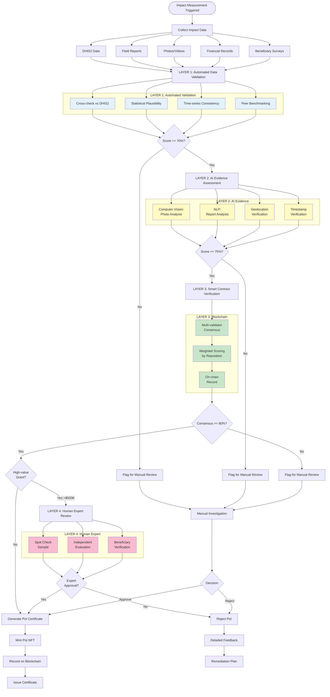

---

## 7. AI AUTOMATION DECISION MATRIX

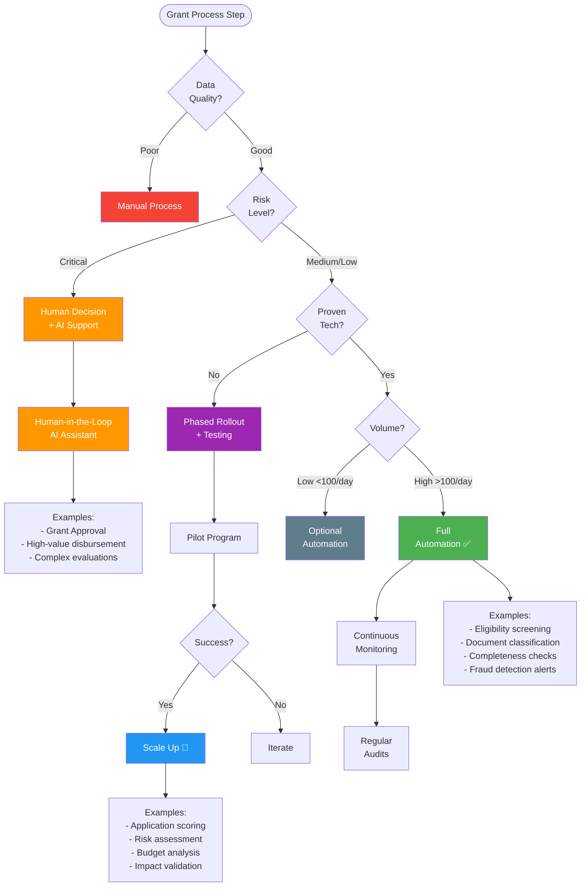

---

## 8. EMERGENCY FUNDING FAST-TRACK PROCESS

```mermaid
graph LR
    subgraph "DAY 0-3: Crisis Detection"
        C1[Gap Detected] --> C2[AI Rapid<br/>Assessment]
        C2 --> C3[Priority<br/>Score]
        C3 --> C4{Emergency?}
        C4 -->|No| Standard[Standard<br/>Process<br/>6-9 months]
        C4 -->|Yes| Fast[FAST-TRACK<br/>30-45 days]
    end
    
    subgraph "DAY 3-10: Application"
        F1[Simplified<br/>Application]
        F2[AI Pre-screening<br/>2-3 days]
        F3[Auto-eligibility<br/>< 24h]
        
        F1 --> F3
        F3 --> F2
    end
    
    subgraph "DAY 10-20: Rapid Review"
        R1[Parallel Review<br/>Technical + Financial]
        R2[AI Risk Score]
        R3[Expert Panel<br/>3-5 days]
        
        R1 --> R2
        R2 --> R3
    end
    
    subgraph "DAY 20-25: Approval"
        A1[Expedited<br/>Committee]
        A2[Conditional<br/>Approval]
        A3[Smart Contract<br/>Setup]
    end
    
    subgraph "DAY 25-30: Disbursement"
        D1[Rapid<br/>Compliance]
        D2[Blockchain<br/>Transaction]
        D3[Funds<br/>Released]
    end
    
    subgraph "ONGOING: Enhanced Monitoring"
        M1[Real-time<br/>Tracking]
        M2[AI Anomaly<br/>Detection]
        M3[Weekly<br/>Check-ins]
    end
    
    Fast --> F1
    F2 --> R1
    R3 --> A1
    A1 --> A2
    A2 --> A3
    A3 --> D1
    D1 --> D2
    D2 --> D3
    D3 --> M1
    M1 --> M2
    M2 --> M3
    
    style C2 fill:#ffeb3b
    style C3 fill:#ffeb3b
    style F2 fill:#ffeb3b
    style F3 fill:#ffeb3b
    style R2 fill:#ffeb3b
    style M2 fill:#ffeb3b
    
    style A3 fill:#4caf50
    style D2 fill:#4caf50
    
    style Fast fill:#ff5722,color:#fff
```

---

## 9. INTEGRATION ARCHITECTURE - DHIS2 FOCUS

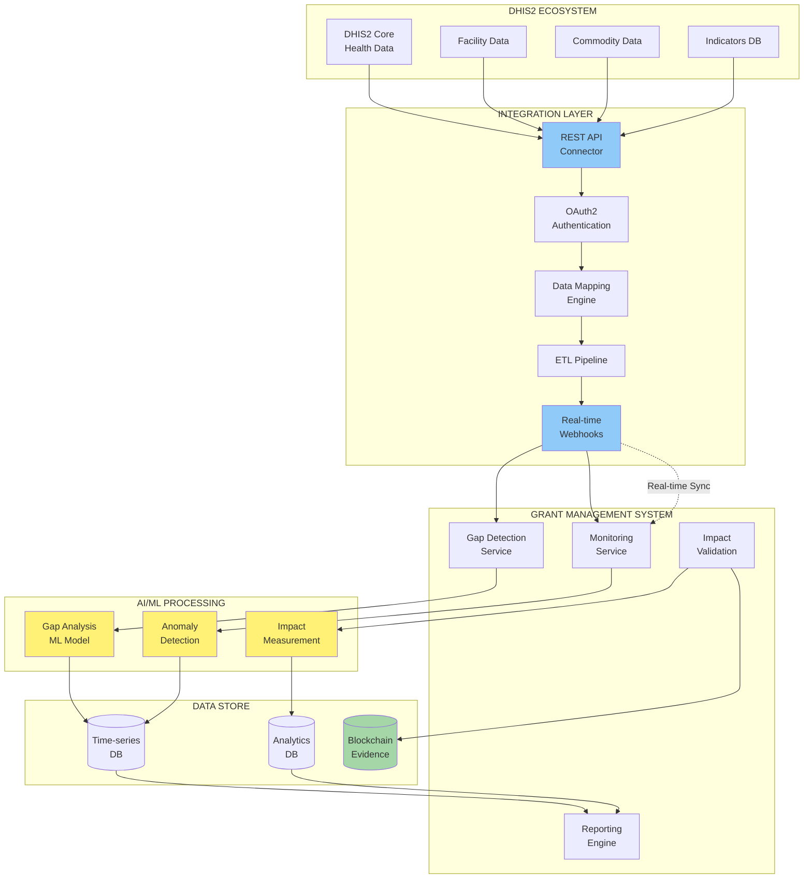

---

## 10. SECURITY & COMPLIANCE LAYERS

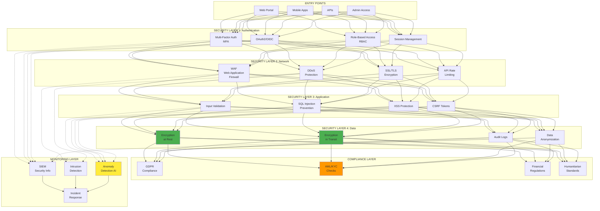

---

## 11. DEPLOYMENT ARCHITECTURE - KUBERNETES

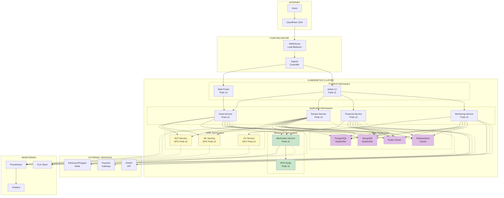

---

## ЛЕГЕНДА ЦВЕТОВ

- 🟡 **Желтый** = AI/ML Processing Components
- 🟢 **Зеленый** = Blockchain Components
- 🔵 **Синий** = Integration/API Components
- 🟣 **Фиолетовый** = Data Storage Components
- 🟠 **Оранжевый** = Human Decision Points
- 🔴 **Красный** = Critical/High-Risk Components

---

## КЛЮЧЕВЫЕ INSIGHTS ИЗ ДИАГРАММ

### 1. AUTOMATION POINTS
- **Входящий поток**: 80% screening automated (AI)
- **Review процесс**: 60% scoring automated + human final decision
- **Disbursement**: 90% automated via smart contracts
- **Monitoring**: 70% real-time automated alerts

### 2. BLOCKCHAIN TOUCHPOINTS
- Grant Registration (immutable record)
- Milestone-based disbursement (smart contracts)
- Evidence logging (IPFS + blockchain)
- Proof-of-Impact NFT (final validation)

### 3. DATA FLOWS
- **Real-time**: DHIS2 → Gap Detection (streaming)
- **Batch**: Reports → Impact Validation (daily)
- **Event-driven**: Milestone completion → Disbursement trigger
- **On-demand**: User queries → Analytics engine

### 4. CRITICAL PATHS
- **Fast-track**: 30-45 days (emergency funding)
- **Standard**: 6-9 months (regular grants)
- **Proof-of-Impact**: 2-4 weeks post-implementation

### 5. SCALING CONSIDERATIONS
- Kubernetes auto-scaling на базе load
- AI/ML services требуют GPU pods (costly)
- Blockchain nodes можно использовать managed services
- Data storage растёт линейно с grant volume

