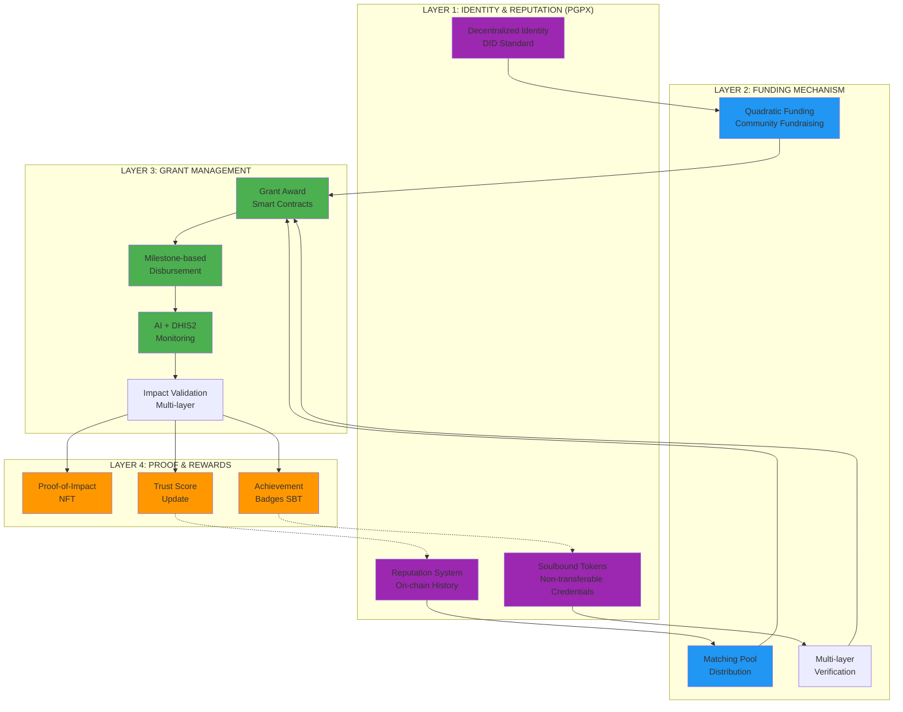
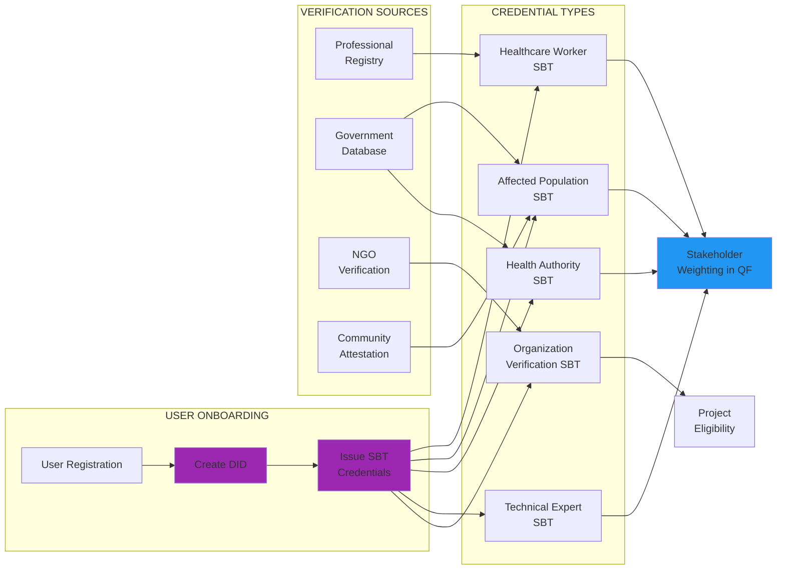
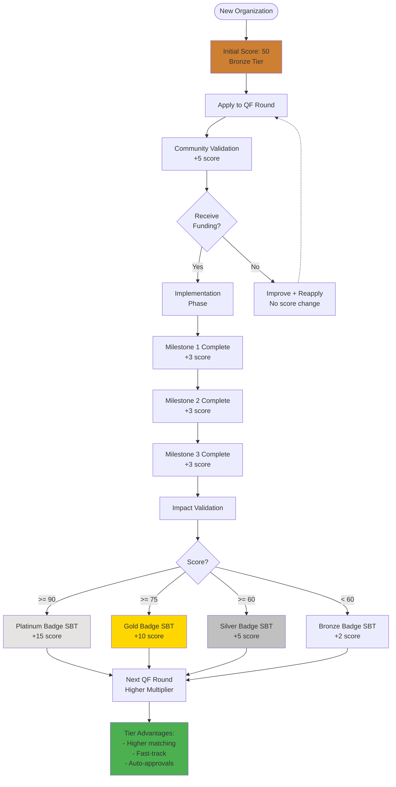
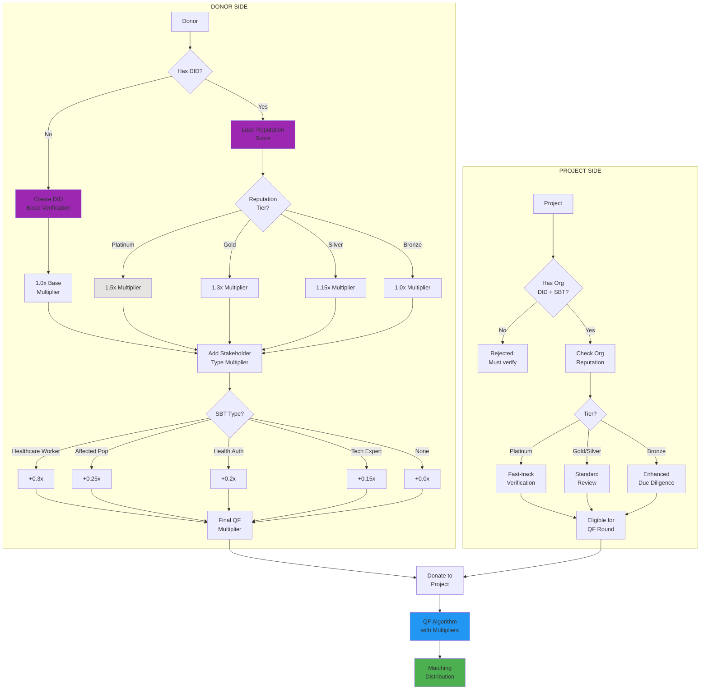
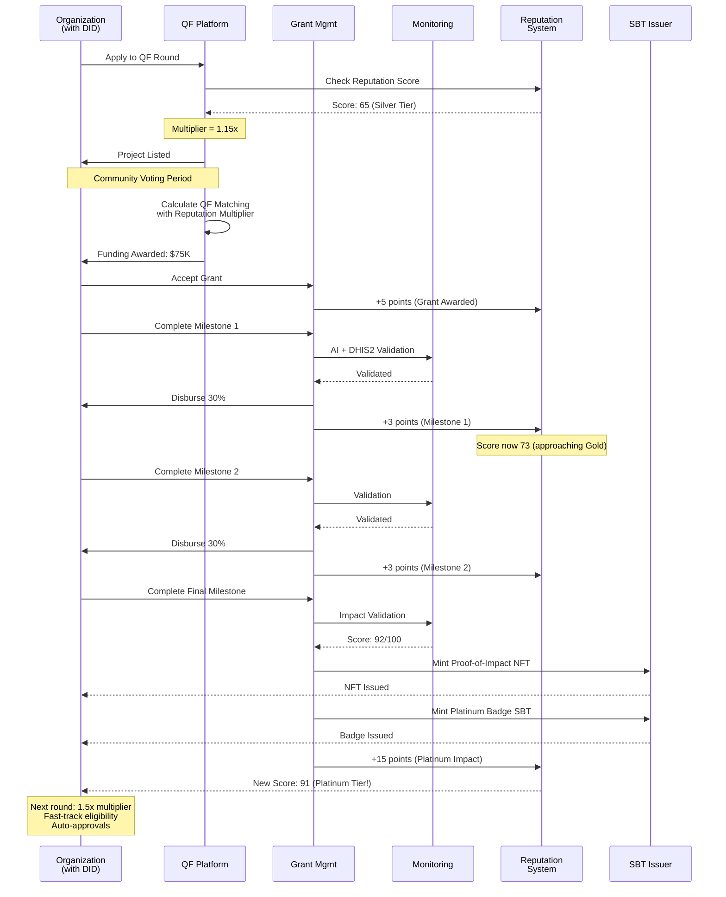
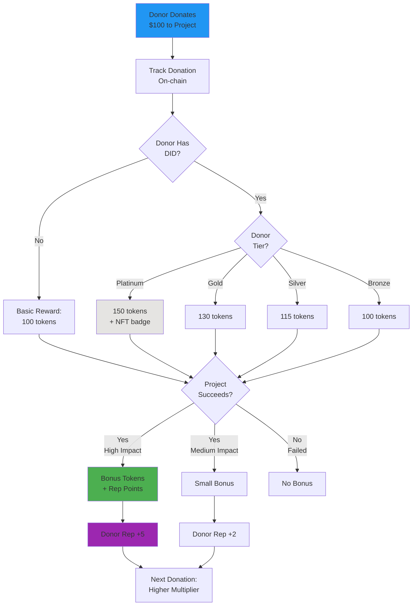
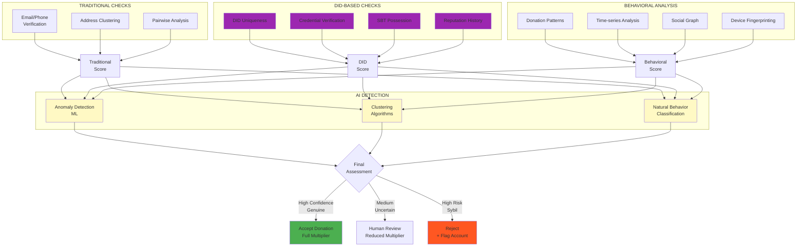
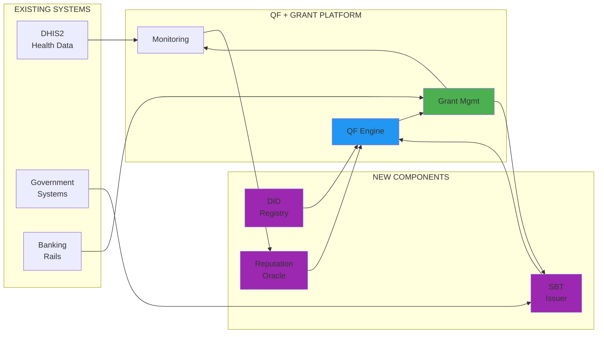

# INTEGRATED ARCHITECTURE: QF + Emergency Grants + DID/Reputation

## SYSTEM OVERVIEW

Интеграция трех систем для создания complete ecosystem:



---

## DETAILED INTEGRATION POINTS

### 1. IDENTITY LAYER (DID + SBT)

**Problem Solved:**
- Sybil resistance в QF
- Stakeholder verification (healthcare workers, communities, etc.)
- Persistent reputation across rounds
- Credential verification for organizations

**Implementation:**



**Key Innovations:**
- **Healthcare Worker SBT**: Verified через professional registries → 1.3x QF multiplier
- **Affected Population SBT**: Verified через geographic + community attestation → 1.25x multiplier
- **Organization SBT**: Track record, financial capacity, compliance → Project eligibility
- **Non-transferable**: Cannot game system by selling credentials

---

### 2. REPUTATION SYSTEM

**On-chain Reputation Score Components:**

```python
def calculate_reputation_score(user_did):
    """
    Multi-dimensional reputation score для QF participants
    """
    score_components = {
        'participation_history': {
            'qf_rounds_participated': weight_0_20,
            'grants_completed': weight_0_30,
            'consistency': weight_0_10  # Regular participation
        },

        'impact_delivered': {
            'poi_nfts_earned': weight_0_25,
            'validation_scores': weight_0_30,
            'beneficiaries_reached': weight_0_20
        },

        'community_trust': {
            'peer_attestations': weight_0_15,
            'dispute_history': weight_minus_50,  # Negative if disputes
            'transparency_score': weight_0_20
        },

        'financial_integrity': {
            'on_time_reporting': weight_0_25,
            'budget_adherence': weight_0_20,
            'fraud_flags': weight_minus_100  # Major penalty
        },

        'collaboration': {
            'gov_partnerships': weight_0_15,
            'knowledge_sharing': weight_0_10,
            'mentorship': weight_0_10
        }
    }

    # Weighted calculation
    total_score = calculate_weighted_sum(score_components)

    # Normalize to 0-100
    reputation_score = normalize(total_score, 0, 100)

    return {
        'overall_score': reputation_score,
        'breakdown': score_components,
        'tier': get_reputation_tier(reputation_score),
        'multiplier': get_qf_multiplier(reputation_score)
    }


def get_reputation_tier(score):
    """
    Reputation tiers with benefits
    """
    if score >= 90:
        return {
            'tier': 'Platinum',
            'qf_multiplier': 1.5,
            'fast_track_eligibility': True,
            'max_grant_size': 'unlimited',
            'auto_approve_milestones': True
        }
    elif score >= 75:
        return {
            'tier': 'Gold',
            'qf_multiplier': 1.3,
            'fast_track_eligibility': True,
            'max_grant_size': 500000,
            'auto_approve_milestones': False
        }
    elif score >= 60:
        return {
            'tier': 'Silver',
            'qf_multiplier': 1.15,
            'fast_track_eligibility': False,
            'max_grant_size': 200000,
            'auto_approve_milestones': False
        }
    else:
        return {
            'tier': 'Bronze',
            'qf_multiplier': 1.0,
            'fast_track_eligibility': False,
            'max_grant_size': 50000,
            'auto_approve_milestones': False
        }
```

**Reputation Flow:**



---

### 3. ENHANCED QF MECHANISM

**Integration с DID/Reputation:**



**Modified QF Formula:**

```
Match для проекта P = (Σ(√ci × Mi × Si))²

где:
- ci = contribution i для проекта P
- Mi = Reputation multiplier донора (1.0 - 1.5)
- Si = Stakeholder type multiplier донора (1.0 - 1.3)

Итоговый multiplier: Mi × Si
Max possible: 1.5 × 1.3 = 1.95x
```

---

### 4. GRANT LIFECYCLE WITH REPUTATION UPDATES



---

### 5. PROOF-OF-IMPACT NFT + REPUTATION

**Enhanced NFT Metadata:**

```json
{
  "type": "ProofOfImpact",
  "standard": "ERC-721",
  "grantInfo": {
    "grantId": "QF-R1-2024-12345",
    "projectName": "Community Health Worker Training",
    "organization": {
      "did": "did:near:health-ngo-kenya.near",
      "name": "LocalHealthNGO",
      "reputationScore": 91,
      "tier": "Platinum"
    },
    "funding": {
      "crowdfunding": 15000,
      "qfMatching": 45000,
      "matchingMultiplier": 1.15,
      "totalAmount": 60000
    }
  },
  "impact": {
    "beneficiaries": {
      "direct": 250,
      "indirect": 1500
    },
    "outcomes": {
      "healthWorkersTrained": 50,
      "communitiesReached": 15,
      "servicesImproved": ["antenatal", "immunization", "malaria"],
      "dhis2Integration": true,
      "governmentPartnership": true
    },
    "validationScore": 92,
    "validationLayers": {
      "automated": "passed",
      "ai": "passed",
      "blockchain": "passed",
      "expert": "passed"
    }
  },
  "reputation": {
    "previousScore": 73,
    "scoreGain": 18,
    "newScore": 91,
    "tierUpgrade": "Silver → Platinum",
    "achievements": [
      "First Platinum Impact",
      "Government Partnership",
      "100% Milestone Success",
      "DHIS2 Integration Complete"
    ]
  },
  "badges": [
    {
      "type": "SoulboundToken",
      "name": "Platinum Impact Badge",
      "issuer": "Health QF Platform",
      "permanent": true,
      "benefits": [
        "1.5x QF multiplier next round",
        "Fast-track verification",
        "Auto-approval milestones <$50K",
        "Mentor program access"
      ]
    }
  ],
  "evidenceHash": "QmX...",
  "mintDate": "2024-12-01",
  "validators": ["0xABC...", "0xDEF...", "0x123..."]
}
```

---

### 6. DONOR INCENTIVES + REPUTATION

**GIVbacks-style System с Reputation:**



**Donor Reputation Benefits:**
- Platinum donors: 1.5x matching power в QF
- Early access to новым QF rounds
- Exclusive impact reports
- NFT donor badges
- Community governance права

---

### 7. ANTI-SYBIL ENHANCED

**Multi-layer Sybil Detection:**



**DID-based Advantages:**
- **Unique DID required**: Can't create 100 accounts
- **SBT verification**: Must prove real identity
- **Reputation stake**: Sybil attack risks reputation
- **Cross-round tracking**: Can't reset identity
- **Social graph**: Real networks look different

---

## KEY INNOVATIONS

### 1. Persistent Identity Across Funding Cycles
- Traditional: New application каждый раз
- **Our system**: DID + reputation carries over
- Platinum organizations fast-tracked
- Trust builds over time

### 2. Stakeholder-Weighted QF
- Traditional QF: 1 dollar = 1 sqrt vote
- **Our system**: Multipliers based on verified stakeholder type
- Healthcare workers get higher weight
- Affected populations prioritized

### 3. Reputation-Based Benefits
- Traditional: Same rules for everyone
- **Our system**:
  - Platinum tier → auto-approvals
  - Gold tier → fast-track verification
  - Bronze tier → enhanced due diligence

### 4. Composable Credentials
- **SBT Stack**:
  - Organization verification SBT
  - Platinum impact badge SBT
  - Healthcare worker credential SBT
  - Community attestation SBT
  - All non-transferable, verifiable

### 5. Impact → Reputation Loop
- Good impact → Higher reputation
- Higher reputation → Better funding terms
- Better funding → More capacity
- More capacity → Bigger impact
- **Virtuous cycle**

---

## TECHNICAL ARCHITECTURE

### Smart Contract Stack:

```
LAYER 1: Identity & Credentials
├── DIDRegistry.sol
├── SBTIssuer.sol
├── CredentialVerifier.sol
└── ReputationOracle.sol

LAYER 2: QF Mechanism
├── QFMatchingPool.sol
├── DonationRouter.sol (with DID verification)
├── MultiStakeholderQF.sol (weighted calculation)
└── AntiSybil.sol

LAYER 3: Grant Management
├── GrantAgreement.sol
├── MilestoneManager.sol
├── EvidenceStorage.sol (IPFS)
└── DisbursementEngine.sol

LAYER 4: Proof & Rewards
├── ProofOfImpactNFT.sol
├── BadgeIssuer.sol (SBTs)
├── ReputationUpdater.sol
└── DonorRewards.sol
```

### Integration Points:



---

## ROADMAP INTEGRATION

### Phase 1: MVP (Current Emergency Grant + Basic QF)
- ✅ Emergency grant architecture (existing)
- ✅ QF concept design (new doc)
- 🔨 Basic DID integration (next)

### Phase 2: DID + Reputation Launch
- DID registry deployment
- Basic SBT issuance (org verification)
- Reputation system v1
- Enhanced QF with multipliers

### Phase 3: Full Stack
- Complete SBT credential types
- Advanced reputation tiers
- Auto-approval systems
- Cross-platform identity

### Phase 4: Ecosystem
- Open DID/SBT standards
- Multi-platform reputation
- Industry adoption
- Government integration

---

## NEXT STEPS

### Immediate:
1. **Copy QF concept** → emergency-grant-docs
2. **Create integration diagrams** (this document)
3. **Design DID/SBT schema** for health sector
4. **Prototype reputation algorithm**

### Short-term:
1. Deploy test DID registry
2. Issue test SBTs
3. Integrate with QF prototype
4. Run pilot with 10 organizations

### Medium-term:
1. Full reputation system
2. Multi-tier benefits
3. Government credential integration
4. Scale to production

Что думаешь? Нужно ли добавить эту интеграцию в основную документацию?
