# QUADRATIC FUNDING MATCHING FUND ДЛЯ HEALTH SECTOR
## Концепт альтернативной архитектуры финансирования

---

## EXECUTIVE SUMMARY

### Проблема

Традиционные системы финансирования здравоохранения (включая Global Fund) сталкиваются с:
- **Funding Gaps**: UN appeals funded только 52% (2023), снижение с 58% (2016-2022)
- **Short-term cycles**: Unsustainable funding модели
- **Top-down approach**: Отсутствие community voice в распределении средств
- **Implementation Gap**: Есть funding, но НЕТ infrastructure для service delivery и работы с governments
- **Humanitarian-Development Divide**: Parallel systems вместо integrated approach

### Решение: Hybrid QF + Professional Grant Management System

**Quadratic Funding (QF) механизм** от Gitcoin/Giveth используется для:
- Демократичный fundraising (community-driven)
- Fair распределение matching pool
- Amplification малых доноров
- Incentivizing broad community support

**Professional Grant Management** добавляет:
- Structured implementation cycles
- Government collaboration framework
- Milestone-based disbursement
- Impact validation system
- Real service delivery infrastructure

### Ключевая Инновация

```
QF Matching (Gitcoin/Giveth)     ────┐
  ↓ Community fundraising              │
  ↓ Fair allocation                    ├──→  HYBRID SYSTEM
                                       │
Professional Grant Cycle      ────┘
  ↓ Implementation support
  ↓ Government integration
  ↓ Service delivery
```

Мы **не просто раздаем деньги** (как Gitcoin/Giveth), мы создаем **complete ecosystem** от fundraising до actual impact.

---

## ЧАСТЬ 1: QUADRATIC FUNDING МЕХАНИКА

### 1.1 Core QF Formula (Capital-Constrained Liberal Radicalism - CLR)

**Базовая формула Gitcoin:**
```
Match для проекта P = (Σ√ci)² 
где ci = contribution i для проекта P
```

**Ключевой принцип:**
- **Количество доноров** > **размер доната**
- Проект с 100 донатами по $10 получит БОЛЬШЕ matching funds чем проект с 1 донатом в $1000

### 1.2 Pairwise Collusion Resistance

**Problem:** Sybil атаки и collusion (один человек = много fake аккаунтов)

**Solution:** Pairwise mechanism from Vitalik Buterin
```
Если два донора A и B часто донатят одним и тем же проектам:
→ Их "similarity score" растет
→ Их matching power для общих проектов СНИЖАЕТСЯ
```

**Giveth Innovation:** Connection-Oriented Cluster Match (COCM)
- Donors группируются в clusters по поведению
- Clusters с высокой internal similarity получают меньший matching multiplier
- Amplifies impact unique donors с diverse portfolio

### 1.3 Trust Bonus & Verification (Gitcoin)

**Verification Levels:**
- Unverified: 50% impact на matching pool
- Basic verified (SMS, email): 100% impact
- Full verified (Twitter, BrightID, Gitcoin Passport): 150% impact

**Gitcoin Passport Score:**
- Composite score из multiple verification sources
- Dynamic weighting на основе historical behavior
- Prevents Sybil attacks while не excluding genuine small donors

### 1.4 GIVbacks Reward System (Giveth)

**Donor Incentives:**
```
Donate → Verified Project
  ↓
100% donation → Project
  +
GIV tokens → Donor (reward)
```

**GIVpower Staking:**
- Stake GIV → получить GIVpower
- Use GIVpower to "boost" favorite projects
- Boosted projects:
  - Higher visibility in UI
  - More GIVbacks for their donors
  - Better positioning in QF rounds

---

## ЧАСТЬ 2: ADAPTATION ДЛЯ HEALTH SECTOR

### 2.1 Health Sector Challenges

**Traditional Funding Problems:**
1. **Vertical vs Horizontal Divide**:
   - Disease-specific funding (HIV, Malaria) vs health systems strengthening
   - Example: Rwanda 2003 — $47M for HIV (3% prevalence) vs $18M для malaria (leading cause of death)

2. **Humanitarian-Development Gap**:
   - Emergency response отделен от long-term development
   - No integration between crisis funding и system building

3. **Governance Issues**:
   - High staff turnover
   - Short funding cycles
   - Poor beneficiary engagement
   - Bypassing local health systems

4. **Accountability Gap**:
   - Limited transparency
   - Donor-driven priorities vs community needs
   - Weak monitoring systems

### 2.2 QF Modifications для Health

**A. Multi-Stakeholder Voting Community**

Traditional QF: Anyone can donate/vote
Health QF: **Weighted voting system** by stakeholder type:

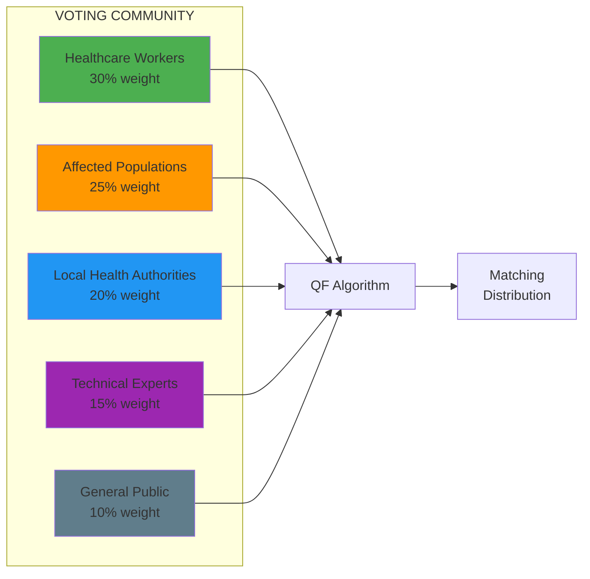

**Rationale:**
- Healthcare workers знают operational реалии
- Affected populations знают actual needs
- Local authorities обеспечивают sustainability
- Technical experts validate feasibility
- General public обеспечивает broad legitimacy

**B. Thematic Matching Pools**

Вместо одного большого pool, создаем **специализированные pools**:

| Pool Theme | Focus Areas | Example Allocations |
|------------|-------------|---------------------|
| **Emergency Health** | Outbreak response, disaster relief, emergency supplies | 30% of total matching |
| **Health Systems** | Infrastructure, training, equipment, HMIS | 25% of total matching |
| **Primary Care** | Community health, prevention, maternal/child health | 20% of total matching |
| **Innovation** | Digital health, new models, pilot programs | 15% of total matching |
| **Resilience** | Supply chain, stockpiling, preparedness | 10% of total matching |

**C. Geographic Verification**

**Problem:** В humanitarian секторе critical что funding идет туда где нужно

**Solution:**
```
Location-based verification:
1. Projects must be registered в specific geography
2. Donors from affected regions получают higher matching multiplier
3. Cross-validation с DHIS2 geographic data
4. Geolocation evidence для impact validation
```

**D. Compliance & Standards Requirements**

**Pre-requisites для участия в QF Round:**
1. ✅ Project verification (not just donor verification)
   - Organization registration
   - Track record or credible plan
   - Technical capability assessment
   - Financial management capacity

2. ✅ Humanitarian Principles adherence
   - Neutrality
   - Impartiality
   - Independence
   - Do No Harm commitment

3. ✅ Integration plan с national health system
   - Не parallel system
   - Collaboration framework с Ministry of Health
   - Handover strategy

---

## ЧАСТЬ 3: HYBRID ARCHITECTURE — QF + PROFESSIONAL GRANT MANAGEMENT

### 3.1 System Overview

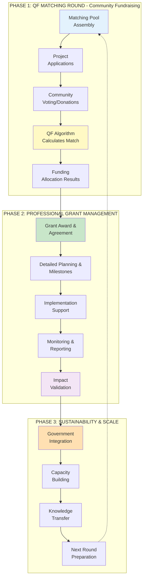

### 3.2 Detailed Phases

#### PHASE 1: QF MATCHING ROUND (2-4 недели)

**ЭТАП 1.1: Matching Pool Assembly**

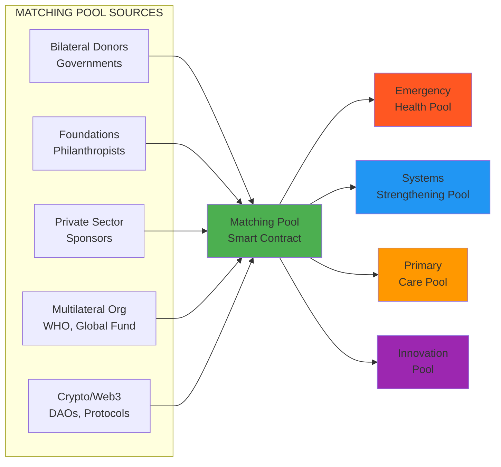

**Key Activities:**
- Fundraising from matching partners
- Thematic allocation определяется governance
- Smart contract deployment для transparency
- Pool size announcement перед round start

---

**ЭТАП 1.2: Project Applications & Verification**

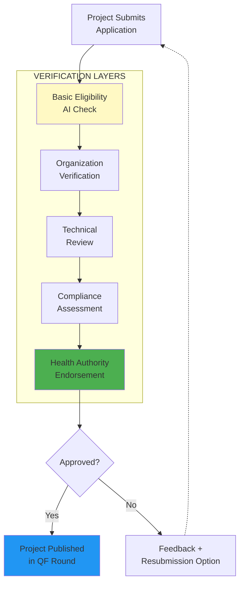

**Verification Criteria:**
- Legal registration и good standing
- Track record ИЛИ credible team/plan для new organizations
- Budget realism assessment
- Community support evidence
- Integration plan с health system
- Humanitarian principles commitment

---

**ЭТАП 1.3: Community Voting/Donation Period**

**Duration:** 14-21 days

**Donor Journey:**
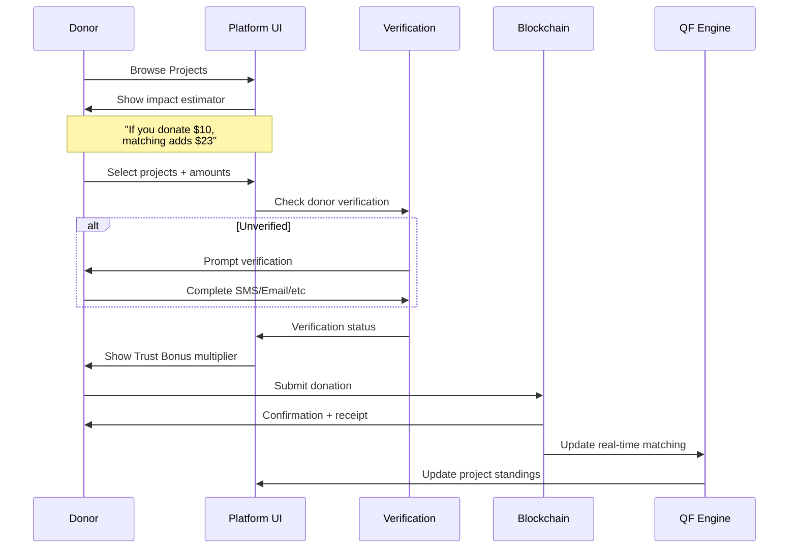

**Real-time Features:**
- Live matching estimates для каждого доната
- Project leaderboards (with caveats про final calculations)
- Community milestones & celebrations
- Donor rewards (GIVbacks-style tokens)

**Trust Bonus Calculation:**
```
Final Matching Impact = Base Donation × Trust Multiplier

Trust Multiplier factors:
- Verification level: 0.5x (none) to 1.5x (full)
- Donor history: 1.0x (new) to 1.3x (repeat)
- Geographic relevance: 1.0x (general) to 1.2x (local)
- Stakeholder type: 1.0x (public) to 1.3x (healthcare worker)

Max multiplier: 2.3x (fully verified healthcare worker from affected region)
Min multiplier: 0.5x (unverified, first-time, generic)
```

---

**ЭТАП 1.4: QF Algorithm Calculation (Post-Round)**

**Timing:** 3-5 days после окончания donation period

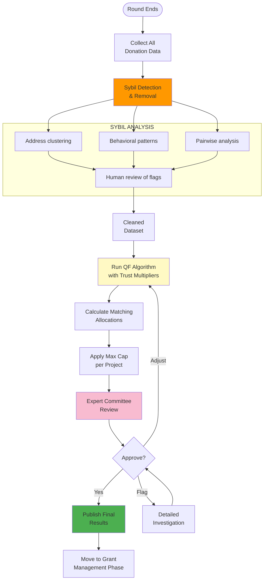

**Max Cap Logic:**
- Prevents single project monopolizing pool
- Typical: 15-20% of thematic pool per project
- Ensures diversification across portfolio

**Expert Committee Review:**
- Health sector experts
- Community representatives
- Ethics oversight
- Final sign-off перед disbursement

---

#### PHASE 2: PROFESSIONAL GRANT MANAGEMENT

Проекты которые получили QF matching funds переходят в **structured grant cycle** с:
- Professional support
- Milestone-based disbursement
- Continuous monitoring
- Government collaboration framework

**Integration с твоей Emergency Grant Architecture:**

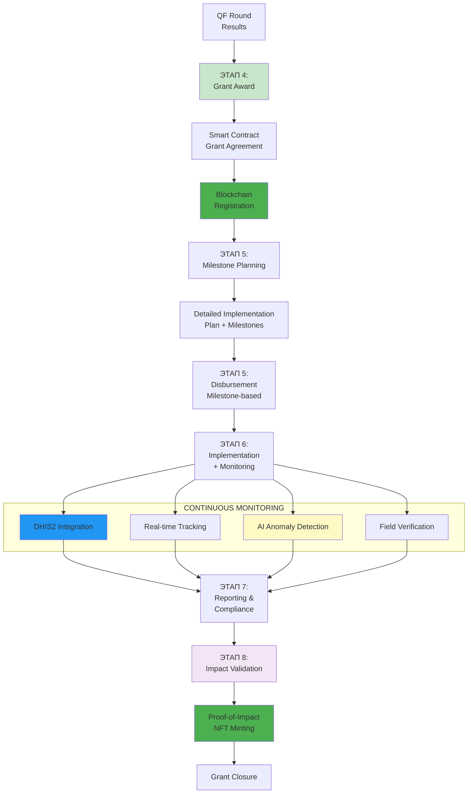

**Key Difference from Traditional:**
- Projects ALREADY have community validation (QF)
- Funding ALREADY secured (matching pool + crowd)
- Focus shifts to **EXECUTION** не на fundraising

---

**ЭТАП 2.1: Grant Award & Agreement**

**Activities:**
- Formal grant award notification
- Negotiation of terms & conditions
- Milestone definition workshop
- Blockchain registration of grant agreement
- Smart contract setup для disbursement

**Grant Agreement NFT:**
```
Grant NFT contains:
- Project details & beneficiaries
- Total funding (crowd + match)
- Milestone definitions
- Payment schedule
- KPIs & success metrics
- Government collaboration commitments
```

---

**ЭТАП 2.2: Milestone-Based Implementation**

**Milestone Structure Example:**

| Milestone | Activities | Deliverables | Funding Release | Timeline |
|-----------|-----------|--------------|-----------------|----------|
| **M1: Setup** | Team recruitment, procurement, baseline assessment | Signed contracts, baseline report, procurement docs | 30% of grant | Month 1-2 |
| **M2: Pilot** | Training, pilot implementation, early monitoring | Training records, pilot results, early data | 25% of grant | Month 3-5 |
| **M3: Scale** | Full rollout, community engagement, gov integration | Scale-up report, DHIS2 integration, community feedback | 25% of grant | Month 6-9 |
| **M4: Sustain** | Handover planning, capacity building, final evaluation | Handover plan, evaluation report, sustainability strategy | 20% of grant | Month 10-12 |

**Smart Contract Logic:**
```solidity
// Simplified pseudo-code
function completeMilestone(
    uint256 grantId,
    uint256 milestoneId,
    string evidenceHash
) public onlyGrantee {
    require(validateEvidence(evidenceHash), "Invalid evidence");
    require(aiValidation(grantId, milestoneId), "AI validation failed");
    require(humanApproval(grantId, milestoneId), "Awaiting approval");
    
    releaseFunds(grantId, milestones[milestoneId].amount);
    emit MilestoneCompleted(grantId, milestoneId, block.timestamp);
}
```

---

**ЭТАП 2.3: Monitoring & Support**

**Continuous Monitoring Stack:**

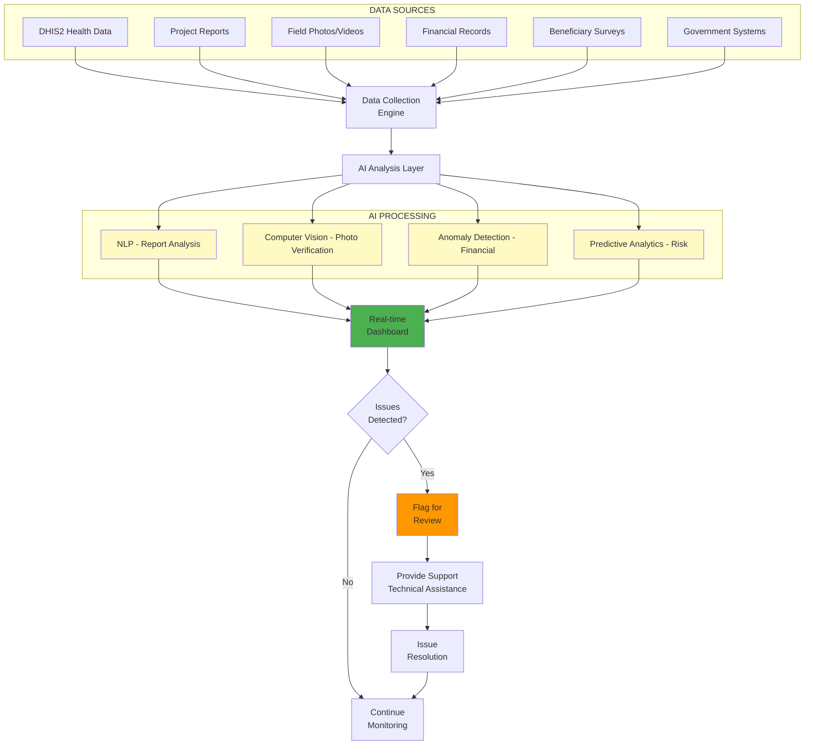

**Support Services:**
- Technical assistance hotline
- Quarterly review meetings
- Troubleshooting support
- Peer learning sessions
- Access to expert network

---

**ЭТАП 2.4: Impact Validation & NFT**

**Multi-Layer Validation** (from твоей architecture):

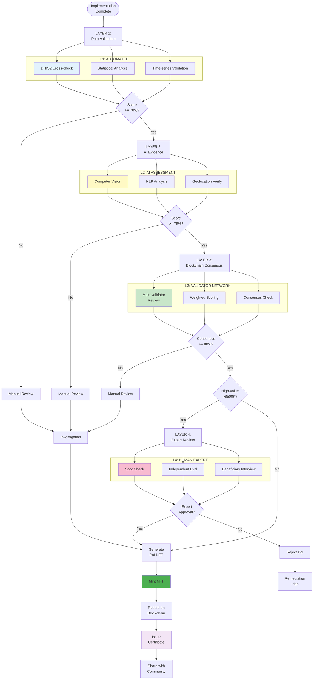

**Proof-of-Impact NFT Metadata:**
```json
{
  "grantId": "QF-R1-2024-12345",
  "projectName": "Community Health Worker Training",
  "organization": "LocalHealthNGO",
  "fundingTotal": {
    "crowdfunding": 15000,
    "qfMatching": 45000,
    "total": 60000
  },
  "beneficiaries": {
    "direct": 250,
    "indirect": 1500
  },
  "outcomes": {
    "healthWorkersT rained": 50,
    "communitiesReached": 15,
    "servicesImproved": ["antenatal", "immunization", "malaria"],
    "dhis2Integration": true
  },
  "validationScore": 94,
  "validationLayers": {
    "automated": "passed",
    "ai": "passed",
    "blockchain": "passed",
    "expert": "passed"
  },
  "evidenceHash": "QmX...",
  "mintDate": "2024-12-01",
  "validators": ["0xABC...", "0xDEF...", "0x123..."]
}
```

---

#### PHASE 3: SUSTAINABILITY & SCALE

**ЭТАП 3.1: Government Integration**

**Handover Process:**

```mermaid
graph LR
    subgraph "PROJECT PHASE"
        P1[NGO Implementation]
        P2[Community Training]
        P3[System Testing]
    end
    
    subgraph "TRANSITION PHASE"
        T1[MoH Engagement]
        T2[Staff Secondment]
        T3[Process Documentation]
        T4[Knowledge Transfer]
    end
    
    subgraph "GOVERNMENT OWNERSHIP"
        G1[MoH Takes Lead]
        G2[Budget Integration]
        G3[National Rollout]
    end
    
    P1 --> P2 --> P3
    P3 --> T1
    T1 --> T2 --> T3 --> T4
    T4 --> G1
    G1 --> G2 --> G3
    
    style P1 fill:#e3f2fd
    style T1 fill:#fff9c4
    style G1 fill:#4caf50
```

**Key Activities:**
- Joint planning sessions с Ministry of Health
- Integration в national health plans
- Budget advocacy for sustainability
- Policy alignment
- Capacity transfer

---

**ЭТАП 3.2: Knowledge Management**

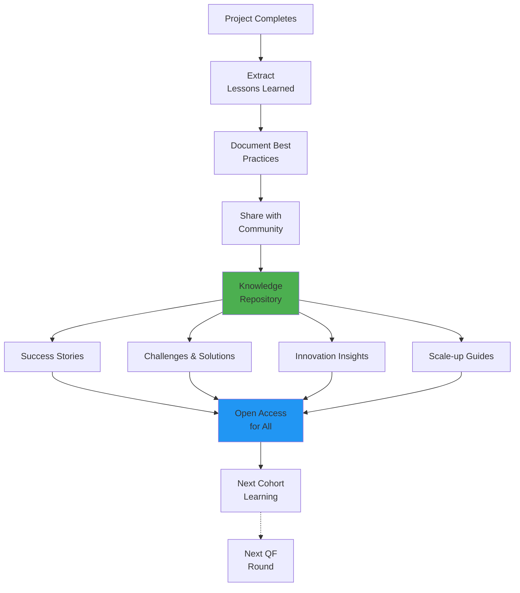

**Knowledge Products:**
- Case studies
- Implementation guides
- Video documentaries
- Webinars & workshops
- Peer mentoring programs

---

**ЭТАП 3.3: Next Round Preparation**

**Continuous Improvement Cycle:**

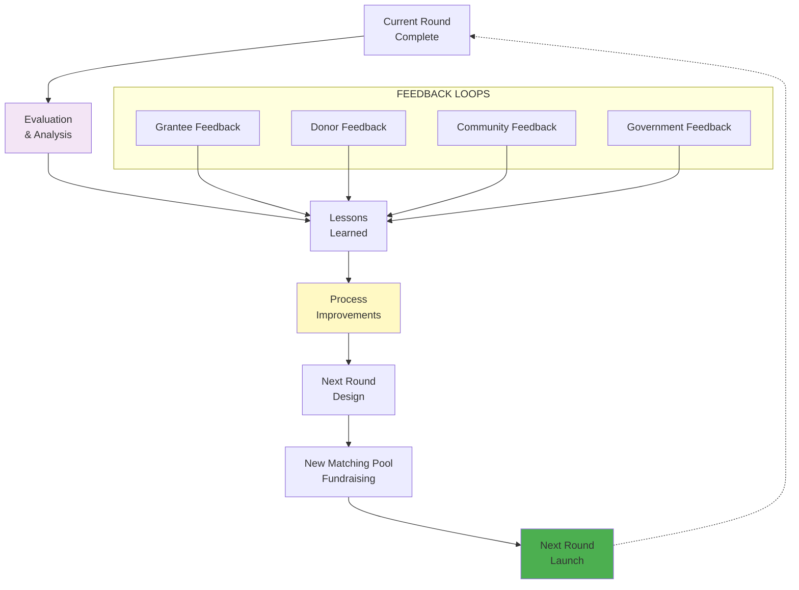

---

## ЧАСТЬ 4: СРАВНИТЕЛЬНАЯ ТАБЛИЦА СИСТЕМ

### 4.1 Traditional vs QF vs Hybrid

| Критерий | Traditional Grants<br/>(Global Fund, USAID) | Pure QF<br/>(Gitcoin, Giveth) | Hybrid QF + Grant Mgmt<br/>**(Наша система)** |
|----------|--------------------------------|---------------------|------------------------------|
| **FUNDRAISING** |
| Donor voice | ❌ Top-down от committees | ✅ Direct community voting | ✅ Community + expert committees |
| Small donor impact | ❌ Minimal | ✅ Amplified через QF | ✅ Amplified + incentivized |
| Transparency | ⚠️ Limited public visibility | ✅ Fully transparent blockchain | ✅ Full transparency + auditability |
| Speed to fund | ❌ 6-9 months | ✅ 2-4 weeks | ⚠️ 4-6 weeks (faster than trad) |
| **ALLOCATION** |
| Democratic | ❌ Committee-driven | ✅ Pure democratic (QF) | ✅ Hybrid (QF + expert validation) |
| Expertise filter | ✅ Yes (pre-screening) | ❌ No (popularity contest risk) | ✅ Yes (multi-layer verification) |
| Geographic targeting | ⚠️ Broad/political | ❌ Not enforced | ✅ Verified + incentivized |
| Collusion resistance | ⚠️ Limited | ✅ Built-in (pairwise) | ✅ Enhanced (multi-factor) |
| **IMPLEMENTATION** |
| Service delivery support | ✅ Yes но top-down | ❌ None (just gives money) | ✅✅ Structured + flexible |
| Government integration | ⚠️ Sometimes bypasses | ❌ No framework | ✅ Built-in requirement |
| Milestone management | ✅ Yes но rigid | ❌ No | ✅ Smart contract automation |
| Continuous monitoring | ⚠️ Periodic reports | ❌ Optional self-reporting | ✅✅ Real-time AI + DHIS2 |
| **ACCOUNTABILITY** |
| Impact validation | ⚠️ Self-reported | ❌ Minimal | ✅✅ Multi-layer AI + expert |
| Community feedback | ❌ Limited | ⚠️ Post-donation only | ✅ Throughout cycle |
| Proof-of-impact | ❌ Internal reports | ❌ None | ✅ Blockchain NFT certificate |
| Fraud prevention | ⚠️ Audit-based (reactive) | ⚠️ Sybil checks only | ✅ Multi-layer proactive |
| **SUSTAINABILITY** |
| Local capacity building | ⚠️ Sometimes | ❌ Not included | ✅ Core component |
| Health system integration | ⚠️ Often parallel | ❌ None | ✅ Mandatory handover plan |
| Knowledge sharing | ⚠️ Internal only | ⚠️ Ad-hoc | ✅ Structured open repository |
| Long-term funding | ⚠️ Uncertain cycles | ❌ Round-based only | ✅ Pathway to govt budget |

**LEGEND:**
- ✅✅ = Best-in-class
- ✅ = Strong
- ⚠️ = Partial/Mixed
- ❌ = Weak/Absent

---

### 4.2 Cost Efficiency Analysis

**Operational Costs by System:**

| Cost Category | Traditional | Pure QF | Hybrid (Ours) |
|--------------|-------------|---------|---------------|
| **Admin Overhead** | 15-25% | 5-8% | 10-15% |
| **Due Diligence** | High (manual) | Low (automated) | Medium (hybrid) |
| **Monitoring** | Medium (periodic) | Low (self-report) | Medium (real-time) |
| **Evaluation** | High (external) | Low (optional) | Medium (AI-assisted) |
| **Tech Infrastructure** | Low (legacy systems) | Medium (blockchain) | High (full stack) |
| **Community Engagement** | Low | High (built-in) | High |
| **TOTAL % TO PROGRAMS** | **75-85%** | **92-95%** | **85-90%** |

**ROI Factors:**
- Traditional: Slow, predictable, risk-averse → **Safe но inefficient**
- Pure QF: Fast, democratic, innovative → **Risky без accountability**
- Hybrid: Balanced speed, accountability, impact → **Optimized for health**

---

## ЧАСТЬ 5: GOVERNANCE MODEL

### 5.1 Multi-Stakeholder Governance

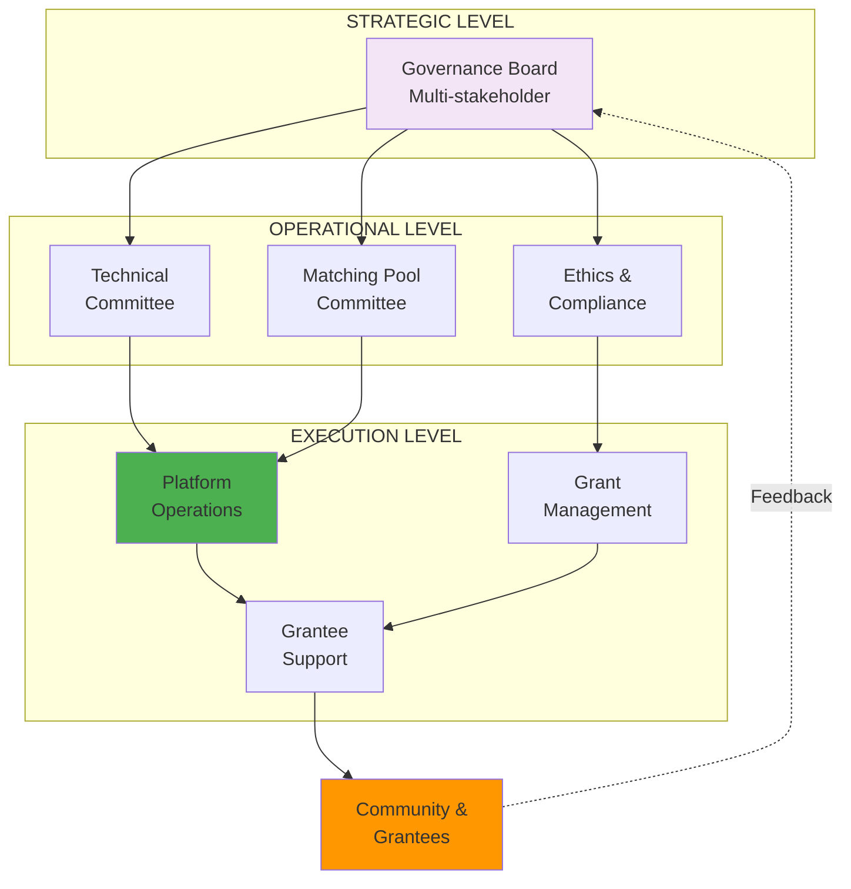

**Governance Board Composition:**
- 30% Health sector experts (technical)
- 25% Community representatives (affected populations)
- 20% Donor representatives (funding partners)
- 15% Government representatives (MoH officials)
- 10% Technology/blockchain experts

**Decision Rights:**
- **Strategic**: Board (unanimous или supermajority)
- **Operational**: Committees (majority)
- **Execution**: Platform team (delegated authority)

---

### 5.2 Key Governance Processes

**A. Matching Pool Allocation**

**Frequency:** Annual review, quarterly adjustments

**Process:**
1. Analysis of health sector needs (DHIS2 data + WHO reports)
2. Community consultation (surveys + town halls)
3. Committee recommendation
4. Board approval
5. Public announcement

**Allocation Logic:**
```
Total Matching Pool Distribution:
├─ Emergency Health (30-40%)
│  └─ Rapid response capability
├─ Health Systems (20-30%)
│  └─ Long-term resilience
├─ Primary Care (20-25%)
│  └─ Preventive services
├─ Innovation (10-15%)
│  └─ Pilot programs
└─ Discretionary Reserve (5-10%)
   └─ Unforeseen needs
```

---

**B. Project Eligibility Standards**

**Technical Committee** reviews and updates eligibility criteria:

**Minimum Requirements:**
1. ✅ Legal entity registered in operation country
2. ✅ Track record OR credible team for new orgs
3. ✅ Financial management capacity
4. ✅ Alignment with humanitarian principles
5. ✅ Integration plan с national health system
6. ✅ Community engagement evidence
7. ✅ Realistic budget & timeline

**Disqualification Criteria:**
1. ❌ Violation of humanitarian principles
2. ❌ Discriminatory practices
3. ❌ Past fraud or mismanagement
4. ❌ Refusal to integrate с government
5. ❌ No community support evidence

---

**C. Dispute Resolution**

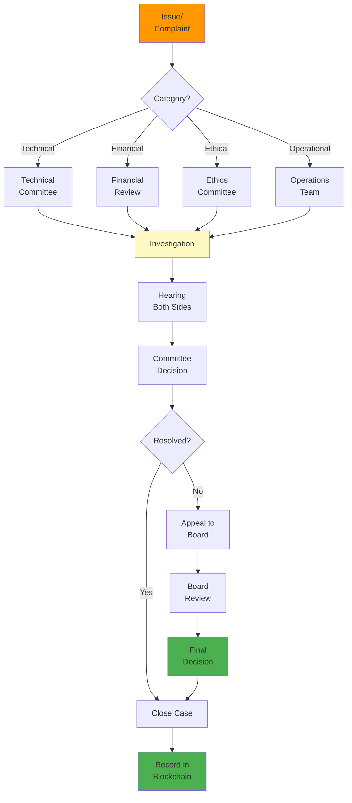

---

## ЧАСТЬ 6: ТЕХНОЛОГИЧЕСКАЯ АРХИТЕКТУРА

### 6.1 System Stack Overview

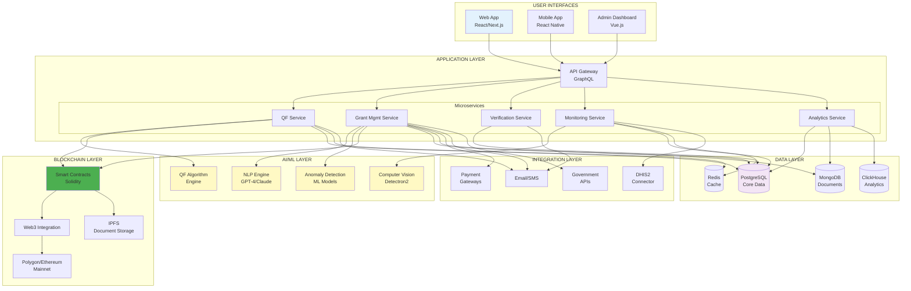

---

### 6.2 QF Algorithm Implementation

**Core Formula with Extensions:**

```python
# Simplified pseudo-code for QF calculation

def calculate_qf_matching(projects, donations, matching_pool, trust_scores):
    """
    Calculate quadratic funding matching для health sector
    
    Parameters:
    - projects: list of project IDs
    - donations: dict {project_id: [(donor_id, amount, trust_multiplier)]}
    - matching_pool: total available matching funds
    - trust_scores: dict {donor_id: trust_multiplier}
    
    Returns:
    - dict {project_id: matching_amount}
    """
    
    # Step 1: Calculate base QF scores
    qf_scores = {}
    for project in projects:
        project_donations = donations[project]
        
        # Sum of square roots with trust multipliers
        sum_sqrt = sum([
            sqrt(amount) * trust_scores[donor] 
            for donor, amount, _ in project_donations
        ])
        
        # Square the sum
        qf_scores[project] = sum_sqrt ** 2
    
    # Step 2: Apply pairwise collusion resistance
    adjusted_scores = apply_pairwise_reduction(qf_scores, donations)
    
    # Step 3: Apply stakeholder weighting (health sector specific)
    weighted_scores = apply_stakeholder_weights(adjusted_scores, donations)
    
    # Step 4: Apply max cap per project (e.g., 20% of pool)
    max_per_project = matching_pool * 0.20
    
    # Step 5: Normalize to matching pool
    total_score = sum(weighted_scores.values())
    matching_allocation = {}
    
    for project, score in weighted_scores.items():
        raw_match = (score / total_score) * matching_pool
        matching_allocation[project] = min(raw_match, max_per_project)
    
    # Step 6: Redistribute capped funds
    remaining = matching_pool - sum(matching_allocation.values())
    if remaining > 0:
        matching_allocation = redistribute_capped_funds(
            matching_allocation, 
            remaining, 
            weighted_scores
        )
    
    return matching_allocation


def apply_pairwise_reduction(scores, donations):
    """
    Reduce scores для donors с high pairwise overlap
    """
    # Build donor-to-projects matrix
    donor_projects = defaultdict(set)
    for project, project_donations in donations.items():
        for donor, _, _ in project_donations:
            donor_projects[donor].add(project)
    
    # Calculate pairwise similarities
    similarities = calculate_donor_similarities(donor_projects)
    
    # Apply reductions
    adjusted_scores = {}
    for project, score in scores.items():
        reduction_factor = calculate_reduction_factor(
            project, 
            donations[project], 
            similarities
        )
        adjusted_scores[project] = score * (1 - reduction_factor)
    
    return adjusted_scores


def apply_stakeholder_weights(scores, donations):
    """
    Apply health sector stakeholder weights
    """
    stakeholder_weights = {
        'healthcare_worker': 1.3,
        'affected_population': 1.25,
        'health_authority': 1.2,
        'technical_expert': 1.15,
        'general_public': 1.0
    }
    
    weighted_scores = {}
    for project, score in scores.items():
        project_donations = donations[project]
        
        # Calculate weighted score based on donor types
        donor_type_distribution = get_donor_types(project_donations)
        
        avg_weight = sum([
            stakeholder_weights[dtype] * ratio
            for dtype, ratio in donor_type_distribution.items()
        ])
        
        weighted_scores[project] = score * avg_weight
    
    return weighted_scores
```

---

### 6.3 Smart Contract Architecture

**Key Contracts:**

```solidity
// Simplified contract structure

contract HealthQFMatchingPool {
    // Pool management
    mapping(uint256 => Pool) public pools;
    mapping(uint256 => mapping(uint256 => Project)) public projects;
    
    struct Pool {
        uint256 totalAmount;
        uint256 roundId;
        uint256 startTime;
        uint256 endTime;
        PoolTheme theme;
        bool finalized;
    }
    
    struct Project {
        address payable beneficiary;
        uint256 poolId;
        uint256 crowdfundedAmount;
        uint256 matchingAmount;
        bool verified;
        bool active;
        ProjectStatus status;
    }
    
    // Donation tracking
    function donate(uint256 projectId) public payable {
        require(projects[projectId].active, "Project not active");
        require(msg.value > 0, "Must donate positive amount");
        
        // Record donation
        donations[projectId].push(Donation({
            donor: msg.sender,
            amount: msg.value,
            timestamp: block.timestamp
        }));
        
        // Update project total
        projects[projectId].crowdfundedAmount += msg.value;
        
        // Transfer immediately to project
        projects[projectId].beneficiary.transfer(msg.value);
        
        emit DonationReceived(projectId, msg.sender, msg.value);
    }
    
    // Matching calculation (called after round ends)
    function finalizeMatching(
        uint256 poolId,
        uint256[] memory projectIds,
        uint256[] memory matchingAmounts
    ) public onlyAdmin {
        require(!pools[poolId].finalized, "Already finalized");
        require(block.timestamp > pools[poolId].endTime, "Round not ended");
        
        uint256 totalMatching = 0;
        
        for (uint i = 0; i < projectIds.length; i++) {
            projects[projectIds[i]].matchingAmount = matchingAmounts[i];
            totalMatching += matchingAmounts[i];
        }
        
        require(totalMatching <= pools[poolId].totalAmount, "Exceeds pool");
        
        pools[poolId].finalized = true;
        
        emit MatchingFinalized(poolId, totalMatching);
    }
    
    // Matching disbursement
    function claimMatching(uint256 projectId) public {
        Project storage project = projects[projectId];
        require(msg.sender == project.beneficiary, "Not beneficiary");
        require(pools[project.poolId].finalized, "Not finalized");
        require(project.matchingAmount > 0, "No matching to claim");
        
        uint256 amount = project.matchingAmount;
        project.matchingAmount = 0;
        
        // Transfer matching funds
        payable(msg.sender).transfer(amount);
        
        emit MatchingClaimed(projectId, msg.sender, amount);
    }
}

contract GrantManagement {
    mapping(uint256 => Grant) public grants;
    mapping(uint256 => Milestone[]) public milestones;
    
    struct Grant {
        uint256 projectId; // Links to QF project
        address payable grantee;
        uint256 totalAmount;
        uint256 disbursed;
        GrantStatus status;
        string ipfsHash; // Grant agreement
    }
    
    struct Milestone {
        string description;
        uint256 amount;
        uint256 deadline;
        string evidenceHash;
        bool completed;
        bool validated;
    }
    
    // Milestone completion
    function completeMilestone(
        uint256 grantId,
        uint256 milestoneId,
        string memory evidenceHash
    ) public {
        Grant storage grant = grants[grantId];
        require(msg.sender == grant.grantee, "Not grantee");
        
        Milestone storage milestone = milestones[grantId][milestoneId];
        require(!milestone.completed, "Already completed");
        
        // Store evidence on IPFS
        milestone.evidenceHash = evidenceHash;
        milestone.completed = true;
        
        emit MilestoneCompleted(grantId, milestoneId, evidenceHash);
        
        // Trigger validation process (off-chain)
        // Funds released after validation
    }
    
    // Milestone validation (by validators)
    function validateMilestone(
        uint256 grantId,
        uint256 milestoneId,
        bool approved
    ) public onlyValidator {
        Milestone storage milestone = milestones[grantId][milestoneId];
        require(milestone.completed, "Not completed");
        require(!milestone.validated, "Already validated");
        
        if (approved) {
            milestone.validated = true;
            
            // Release funds
            Grant storage grant = grants[grantId];
            grant.grantee.transfer(milestone.amount);
            grant.disbursed += milestone.amount;
            
            emit MilestoneValidated(grantId, milestoneId, milestone.amount);
        } else {
            // Trigger remediation process
            emit MilestoneRejected(grantId, milestoneId);
        }
    }
}

contract ProofOfImpact {
    mapping(uint256 => ImpactNFT) public impactNFTs;
    
    struct ImpactNFT {
        uint256 grantId;
        string metadataHash; // IPFS
        uint256 validationScore;
        address[] validators;
        uint256 mintDate;
    }
    
    // Mint impact NFT
    function mintProofOfImpact(
        uint256 grantId,
        string memory metadataHash,
        uint256 validationScore
    ) public onlyValidator {
        require(validationScore >= 80, "Score too low");
        
        uint256 tokenId = _nextTokenId++;
        
        impactNFTs[tokenId] = ImpactNFT({
            grantId: grantId,
            metadataHash: metadataHash,
            validationScore: validationScore,
            validators: msg.sender,
            mintDate: block.timestamp
        });
        
        // Mint ERC-721 NFT
        _safeMint(grants[grantId].grantee, tokenId);
        
        emit ProofOfImpactMinted(tokenId, grantId, validationScore);
    }
}
```

---

### 6.4 Security & Compliance

**Security Layers:**

```mermaid
graph TB
    subgraph "ENTRY SECURITY"
        E1[WAF<br/>Web App Firewall]
        E2[DDoS Protection]
        E3[Rate Limiting]
    end
    
    subgraph "AUTHENTICATION"
        A1[OAuth 2.0 / OIDC]
        A2[Multi-Factor Auth]
        A3[Biometric (Mobile)]
        A4[Hardware Wallet]
    end
    
    subgraph "AUTHORIZATION"
        AZ1[RBAC<br/>Role-Based Access]
        AZ2[ABAC<br/>Attribute-Based]
        AZ3[Smart Contract<br/>Permissions]
    end
    
    subgraph "DATA PROTECTION"
        D1[Encryption at Rest<br/>AES-256]
        D2[Encryption in Transit<br/>TLS 1.3]
        D3[PII Anonymization]
        D4[Data Residency<br/>Compliance]
    end
    
    subgraph "MONITORING"
        M1[SIEM<br/>Security Info]
        M2[Intrusion Detection]
        M3[Anomaly Detection AI]
        M4[Audit Logs<br/>Blockchain]
    end
    
    subgraph "COMPLIANCE"
        C1[GDPR]
        C2[HIPAA<br/>(if health data)]
        C3[AML/KYC]
        C4[Humanitarian<br/>Standards]
    end
    
    E1 & E2 & E3 --> A1
    A1 --> A2 & A3 & A4
    A2 & A3 & A4 --> AZ1 & AZ2 & AZ3
    AZ1 & AZ2 & AZ3 --> D1 & D2 & D3 & D4
    
    D1 & D2 & D3 & D4 -.-> M1 & M2 & M3 & M4
    
    M1 & M2 & M3 & M4 --> C1 & C2 & C3 & C4
    
    style E1 fill:#ff9800
    style A2 fill:#4caf50
    style D1 fill:#4caf50
    style D2 fill:#4caf50
    style M3 fill:#fff9c4
    style M4 fill:#4caf50
```

**Compliance Requirements:**

1. **GDPR (EU)**:
   - Right to be forgotten
   - Data portability
   - Consent management
   - Breach notification

2. **AML/KYC**:
   - Donor verification для large amounts
   - Transaction monitoring
   - Suspicious activity reporting
   - Sanctions screening

3. **Humanitarian Standards**:
   - Core Humanitarian Standard (CHS)
   - Sphere Standards
   - HAP Accountability Framework
   - Grand Bargain commitments

---

## ЧАСТЬ 7: IMPLEMENTATION ROADMAP

### 7.1 Phased Rollout

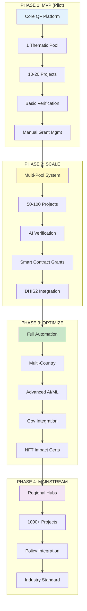

---

### 7.2 Этапы с Activities (БЕЗ сроков и бюджетов)

#### PHASE 1: MVP (MINIMUM VIABLE PRODUCT)

**Objective:** Validate concept с small-scale pilot

**Components:**
1. **Core Platform Development**
   - User authentication system
   - Project submission portal
   - Donation processing (crypto + fiat)
   - Basic QF calculation engine
   - Admin dashboard

2. **Single Thematic Pool**
   - Focus: Emergency Health (для быстрого impact)
   - Matching pool: Initial donors commitment
   - Geographic scope: 1-2 countries (pilot)

3. **Project Portfolio**
   - 10-20 carefully selected projects
   - Mix of established NGOs + grassroots
   - Variety of intervention types
   - All pre-verified

4. **Basic Verification**
   - Manual KYC для donors >$1000
   - Organization verification (legal docs)
   - Basic Sybil checks (email/phone)
   - No AI yet (human review)

5. **Manual Grant Management**
   - Spreadsheet-based milestone tracking
   - Email-based reporting
   - Human validation of evidence
   - Traditional banking disbursement

**Success Metrics:**
- ✅ Successfully complete 1 QF round
- ✅ 100+ unique donors participate
- ✅ 10+ projects receive funding
- ✅ 80%+ community satisfaction
- ✅ Zero fraud incidents
- ✅ All funded projects start implementation

**Lessons Learned Focus:**
- What verification level is sufficient?
- How much donor education is needed?
- What's optimal round duration?
- Which communication channels work best?
- What support do grantees need most?

---

#### PHASE 2: SCALE

**Objective:** Expand coverage, automate processes, integrate AI

**Components:**
1. **Multi-Pool System**
   - Add 2-3 more thematic pools:
     - Health Systems Strengthening
     - Primary Care & Prevention
     - Innovation
   - Each pool independent matching calculation
   - Cross-pool donor participation allowed

2. **Expand Project Portfolio**
   - 50-100 projects across pools
   - More countries (5-10)
   - Diversity in organization types
   - Range of budgets ($5K - $500K)

3. **AI-Powered Verification**
   - Automated eligibility screening
   - NLP document analysis
   - Computer vision for evidence
   - Sybil detection algorithms
   - Still human oversight для final decisions

4. **Smart Contract Grant Management**
   - Automated milestone-based disbursement
   - On-chain grant agreements
   - IPFS document storage
   - Blockchain audit trail
   - Crypto + stablecoin payments

5. **DHIS2 Integration**
   - Real-time health data sync
   - Automated gap detection
   - Impact measurement via DHIS2 indicators
   - Cross-validation of reported results

**Success Metrics:**
- ✅ 3+ QF rounds completed
- ✅ 500+ unique donors
- ✅ $500K+ total raised (crowd + match)
- ✅ 40+ projects successfully completed
- ✅ 90%+ on-time milestone completion
- ✅ AI reduces verification time by 60%

**Lessons Learned Focus:**
- How do multiple pools interact?
- What's optimal AI vs human balance?
- How effective is smart contract automation?
- What DHIS2 integration challenges arise?
- How scalable is support model?

---

#### PHASE 3: OPTIMIZE

**Objective:** Full automation, multi-country, government integration

**Components:**
1. **Full Process Automation**
   - End-to-end automated workflows
   - AI-driven project scoring
   - Automated compliance checks
   - Real-time anomaly detection
   - Self-service для most grantee needs

2. **Multi-Country Expansion**
   - 15-20 countries
   - Regional coordinators
   - Local language support
   - Country-specific adaptation
   - Cross-border collaboration

3. **Advanced AI/ML**
   - Predictive analytics (success probability)
   - Impact forecasting models
   - Optimal allocation algorithms
   - Natural language reporting
   - Computer vision evidence validation

4. **Government Integration Framework**
   - MOU templates с Ministries of Health
   - Integration в national health plans
   - Co-funding mechanisms
   - Joint M&E frameworks
   - Policy advocacy support

5. **NFT Impact Certificates**
   - Automated proof-of-impact NFT minting
   - Multi-validator consensus
   - Public impact ledger
   - Donor recognition NFTs
   - Transferable/tradable impact credits

**Success Metrics:**
- ✅ 10+ countries with government partnerships
- ✅ 1000+ projects funded cumulative
- ✅ $5M+ total funding deployed
- ✅ 95%+ automation rate
- ✅ 85%+ project success rate
- ✅ 50+ impact NFTs minted

**Lessons Learned Focus:**
- What works in government partnerships?
- How sustainable is full automation?
- What's ROI of advanced AI?
- How do NFTs drive behavior?
- What regulatory challenges emerge?

---

#### PHASE 4: MAINSTREAM ADOPTION

**Objective:** Establish as industry standard, scale globally

**Components:**
1. **Regional Hub Model**
   - 5-7 regional hubs (Africa, Asia, LATAM, etc.)
   - Local teams & governance
   - Regional matching pools
   - Cultural/contextual adaptation
   - South-South collaboration

2. **Massive Scale**
   - 50+ countries
   - 1000+ active projects per year
   - 10,000+ donors
   - $50M+ annual matching pool
   - 100+ government partnerships

3. **Policy Integration**
   - National budget integration
   - WHO/Global Fund collaboration
   - Inclusion в humanitarian response plans
   - Disaster preparedness frameworks
   - Universal health coverage pathways

4. **Industry Standard**
   - Open source platform
   - API для third-party integration
   - Certification program
   - Training & capacity building
   - Research & evidence base

**Success Metrics:**
- ✅ Recognized by major donors (USAID, DFID, etc.)
- ✅ Adopted by 5+ countries as official mechanism
- ✅ 10,000+ projects funded cumulative
- ✅ Demonstrated cost-effectiveness vs traditional
- ✅ Published peer-reviewed impact studies
- ✅ Self-sustaining financial model

**Lessons Learned Focus:**
- What's needed for policy adoption?
- How to sustain at scale?
- What business model works long-term?
- How to maintain quality at volume?
- What's path to financial sustainability?

---

### 7.3 Key Assumptions

**For Pilot Success:**
- Initial matching pool donors committed
- 10-20 organizations willing to participate
- 1-2 countries open to pilot (e.g., Kenya, Bangladesh)
- Technical team available
- Regulatory approval feasible

**For Scale:**
- Pilot demonstrates proof-of-concept
- Additional donors interested
- Technology performs as expected
- No major regulatory blockers
- Community reception positive

**For Sustainability:**
- Demonstrated cost-effectiveness
- Government interest in adoption
- Donor fatigue doesn't set in
- Technology continues to improve
- Humanitarian sector evolves

---

## ЧАСТЬ 8: RISK ANALYSIS & MITIGATION

### 8.1 Key Risks

```mermaid
graph TB
    subgraph "TECHNICAL RISKS"
        T1[Smart Contract Bugs]
        T2[Platform Downtime]
        T3[AI Bias/Errors]
        T4[Blockchain Scalability]
    end
    
    subgraph "OPERATIONAL RISKS"
        O1[Sybil Attacks]
        O2[Collusion/Fraud]
        O3[Grantee Failure]
        O4[Staff Capacity]
    end
    
    subgraph "FINANCIAL RISKS"
        F1[Matching Pool Shortage]
        F2[Crypto Volatility]
        F3[Currency Exchange]
        F4[Unsustainable Model]
    end
    
    subgraph "REGULATORY RISKS"
        R1[AML/KYC Compliance]
        R2[Data Privacy Laws]
        R3[Crypto Regulations]
        R4[Country Restrictions]
    end
    
    subgraph "STRATEGIC RISKS"
        S1[Donor Fatigue]
        S2[Competition]
        S3[Government Resistance]
        S4[Reputation Damage]
    end
    
    T1 & T2 & T3 & T4 --> Impact[IMPACT ON<br/>MISSION]
    O1 & O2 & O3 & O4 --> Impact
    F1 & F2 & F3 & F4 --> Impact
    R1 & R2 & R3 & R4 --> Impact
    S1 & S2 & S3 & S4 --> Impact
    
    Impact --> Mitigation[MITIGATION<br/>STRATEGIES]
    
    style Impact fill:#ff5722
    style Mitigation fill:#4caf50
```

---

### 8.2 Mitigation Strategies

| Risk | Likelihood | Impact | Mitigation |
|------|-----------|--------|------------|
| **Smart Contract Bugs** | Medium | Critical | Multiple audits, bug bounty, gradual rollout, insurance |
| **Sybil Attacks** | High | High | Multi-layer verification, pairwise algorithm, AI detection |
| **Matching Pool Shortage** | Medium | High | Diversify donors, reserve fund, flexible pools |
| **Grantee Implementation Failure** | Medium | Medium | Strong support, milestone gates, early intervention |
| **Regulatory Changes** | Low | High | Legal monitoring, flexible architecture, multi-jurisdiction |
| **AI Bias** | Medium | Medium | Diverse training data, human oversight, regular audits |
| **Crypto Volatility** | High | Low | Stablecoin use, immediate conversion, hedging |
| **Donor Fatigue** | Medium | High | Continuous innovation, proven impact, community building |
| **Government Resistance** | Low | Medium | Early engagement, co-design, mutual benefits |
| **Competition** | Medium | Low | Open source, collaboration, unique value prop |

---

## ЧАСТЬ 9: SUCCESS METRICS & KPIs

### 9.1 Key Performance Indicators

**FUNDING METRICS:**
```
├─ Matching Pool Size (growth over time)
├─ Crowdfunding Amount (community mobilization)
├─ Matching Multiplier (average across projects)
├─ Donor Count (unique individuals)
├─ Donor Retention Rate (repeat donors)
└─ Cost-per-$ Raised (efficiency)
```

**PARTICIPATION METRICS:**
```
├─ Project Applications (pipeline)
├─ Verification Success Rate (quality)
├─ Geographic Distribution (reach)
├─ Stakeholder Diversity (healthcare workers, communities, etc.)
├─ Community Engagement (votes, comments, shares)
└─ Donor Verification Rate (trust level)
```

**IMPLEMENTATION METRICS:**
```
├─ Grant Award Rate (% of projects funded)
├─ Milestone Completion Rate (on-time)
├─ Disbursement Speed (days from milestone to payment)
├─ Grantee Satisfaction Score (support quality)
├─ Project Success Rate (impact achieved)
└─ Government Integration Rate (% with MoH partnership)
```

**IMPACT METRICS:**
```
├─ Beneficiaries Reached (direct + indirect)
├─ Health Outcomes Improved (DHIS2 indicators)
├─ Health Systems Strengthened (capacity indicators)
├─ Communities Engaged (participatory metrics)
├─ Knowledge Shared (replication/scale-up)
└─ Proof-of-Impact NFTs Minted (validated impact)
```

**EFFICIENCY METRICS:**
```
├─ Admin Overhead (% of total funds)
├─ Time to Decision (application → funding)
├─ Automation Rate (% fully automated)
├─ Cost per Beneficiary (efficiency)
├─ Fraud Rate (% of incidents)
└─ Dispute Resolution Time (days)
```

---

### 9.2 Dashboard Mockup

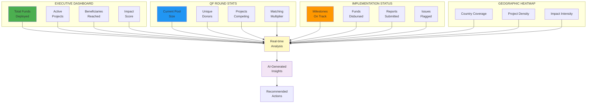

---

## ЧАСТЬ 10: CALL TO ACTION & NEXT STEPS

### 10.1 Strategic Value Proposition

**Почему эта система лучше чем существующие?**

**vs Traditional Grants (Global Fund, USAID):**
✅ Faster funding cycles (weeks vs months)
✅ Community voice в allocation
✅ Lower overhead costs
✅ Real-time transparency
✅ Built-in accountability

**vs Pure QF (Gitcoin, Giveth):**
✅ Health sector expertise
✅ Professional implementation support
✅ Government integration framework
✅ Impact validation system
✅ Service delivery infrastructure

**vs Emergency-only systems:**
✅ Bridges humanitarian-development divide
✅ Sustainability built-in
✅ Prevention + response
✅ Capacity building focus
✅ Long-term resilience

---

### 10.2 Investment Opportunity

**For Matching Pool Sponsors:**
- Democratic allocation of your funds
- Transparent impact tracking
- Brand exposure to engaged community
- Partnership with cutting-edge platform
- Measurable ROI on investment

**For Implementing Partners:**
- Access to flexible funding
- Community validation & support
- Professional implementation support
- Government collaboration framework
- Proof-of-impact certification

**For Governments:**
- No upfront cost (donor-funded)
- Community-driven priorities
- Strengthens health systems
- Builds local capacity
- Sustainable transition pathway

**For Technology Providers:**
- Open source contribution opportunity
- Real-world AI/blockchain use case
- Social impact credentials
- Innovation testbed
- Partnership ecosystem

---

### 10.3 Immediate Next Steps

**If you want to launch pilot:**

**STEP 1: Assemble Core Team**
- Product lead (platform development)
- Health sector expert (technical guidance)
- Blockchain developer (smart contracts)
- QF specialist (algorithm implementation)
- Community manager (donor/grantee engagement)

**STEP 2: Secure Initial Matching Pool**
- Identify 3-5 anchor donors
- Commit initial pool size ($100K-$500K)
- Define thematic focus
- Set timeline for round

**STEP 3: Select Pilot Geography**
- 1-2 countries with:
  - Active health NGO ecosystem
  - Functional DHIS2 system
  - Supportive government
  - Manageable regulatory environment
  - English/local language support

**STEP 4: Build MVP Platform**
- Use existing open source (Gitcoin Grants, Giveth)
- Customize для health sector
- Add verification layers
- Integrate payment rails
- Launch beta testing

**STEP 5: Recruit Pilot Projects**
- Issue call for proposals
- Manual verification process
- 10-20 selected projects
- Training & onboarding
- Pre-round prep workshops

**STEP 6: Launch First QF Round**
- 2-3 week donation period
- Heavy community engagement
- Real-time support
- Post-round analysis
- Transition to grant management

**STEP 7: Document & Learn**
- Rigorous evaluation
- Community feedback
- Process refinement
- Case study development
- Scale-up planning

---

### 10.4 Open Questions for Discussion

1. **Governance:**
   - Who should sit on governance board?
   - How to ensure balanced representation?
   - What decision-making process?

2. **Matching Pool:**
   - Initial size needed for pilot?
   - Mix of crypto vs fiat?
   - Single donor or pooled?
   - Conditions/restrictions?

3. **Geographic Focus:**
   - Which countries for pilot?
   - Single country or multi-country?
   - How to ensure government buy-in?

4. **Technology:**
   - Build from scratch vs fork existing?
   - Which blockchain (Ethereum, Polygon, etc)?
   - Level of automation for pilot?
   - Integration priorities (DHIS2, payment, etc)?

5. **Community:**
   - How to bootstrap initial donor community?
   - Which stakeholder groups to prioritize?
   - Communication strategy?
   - Incentive structure?

6. **Sustainability:**
   - Business model for long-term?
   - Path to financial independence?
   - Revenue streams (if any)?
   - Exit to government ownership?

---

## ЗАКЛЮЧЕНИЕ

Эта hybrid система **Quadratic Funding + Professional Grant Management** представляет собой **третий путь** между:
- Традиционными top-down грантами (медленно, бюрократично, без community voice)
- Pure QF платформами (быстро, демократично, но без execution support)

Мы берем **лучшее из обоих миров**:
- 🌍 **Democratic fundraising** через QF
- 🏗️ **Professional implementation** через structured grant cycle  
- 🤝 **Government integration** для sustainability
- 🔬 **AI/blockchain** для efficiency & accountability
- 🎯 **Health sector focus** с domain expertise

**Ключевая инновация:** Мы не просто раздаем деньги — мы создаем **complete ecosystem** от community-driven fundraising до validated real-world impact.

Это **альтернативная архитектура** которая может быть **более эффективной** системой для финансирования health initiatives, особенно в humanitarian и fragile contexts.

---

**Ready to build?** 🚀
